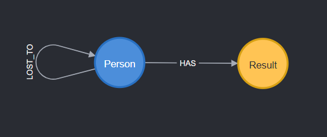
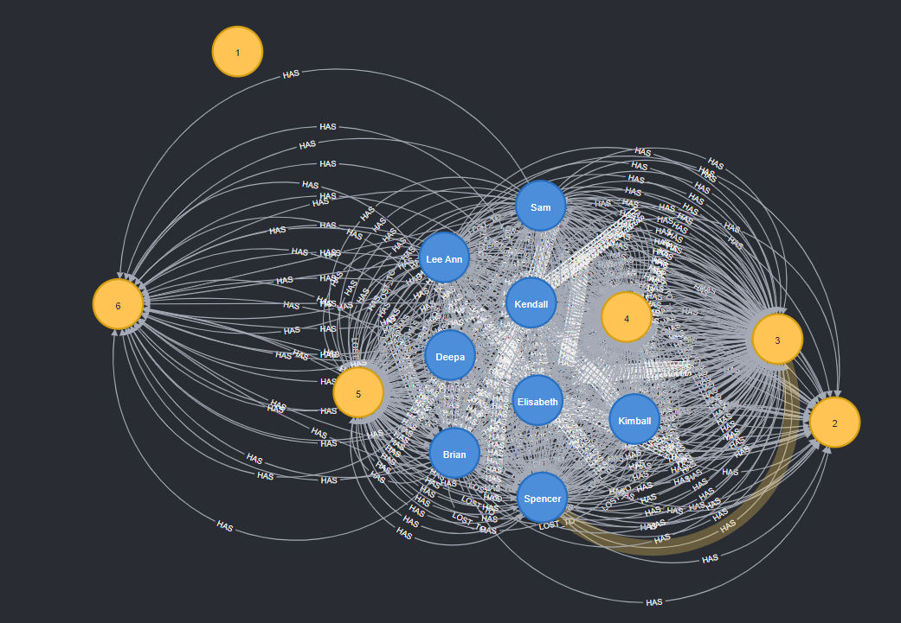

# wordle
Storing Wordle group results as a graph

## schema

## graph
The graph representation of the Wordle results is densely connected. With just 8 Person nodes (number of players in group) and 6 Result nodes (number of possible Wordle answers) we end up with tens or hundreds of relationships between Person nodes and Result nodes. The graph can be thought about as two different graphs unioned together: (1) the daily result scores that each person submits and (2) the rivalry graph where a tiebreaker was needed to determine the winner of the day's Wordle.

Edges contain the date each guess was made or the date of the tiebreaker between two Person nodes.