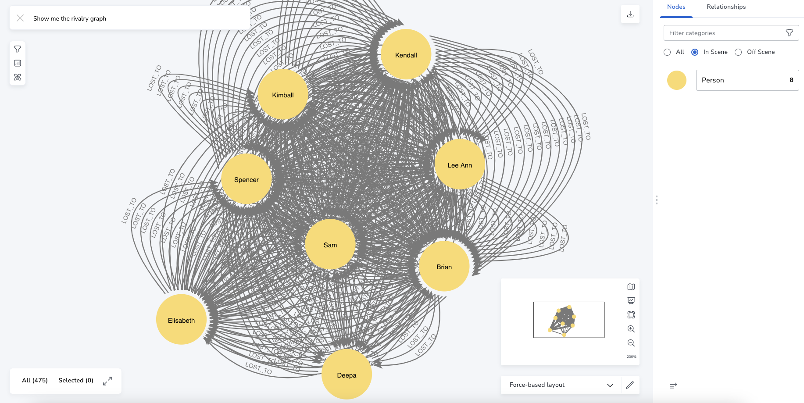

# wordle

Storing Wordle group results as a graph

## graph

The graph representation of the Wordle results is densely connected. With just 8 `Person` nodes (number of players in group) and 6 `Result` nodes (number of possible Wordle answers) we end up with tens or hundreds of relationships between `Person` nodes and `Result` nodes. The graph can be thought about as two different graphs unioned together: (1) the daily result scores that each person submits and (2) the rivalry graph where a tiebreaker was needed to determine the winner of the day's Wordle.

### daily results graph


The above graph is just the results from August 2023. Visually with a smaller graph you can see where the majority of each person's guesses are going.
Edges contain the date each guess was made from a `Person` node to a `Result` node. Example: `(:Person {fname:'Brian'})-[:HAS {dt:'8/28/23'}]->(:Result {result:3})`. So for each day we end up with 1 edge for each `Person` pointing to 1 `Result` node. Below is an example that represents the group's scores capture on just one day.


If all 7 people play today, 7 edges are added. When all days are taken together it creates a very densely connected structure that we are not as much interested in visualizing but querying when the winning number of guesses was shared between two or more people. In this case we can build the rivalry graph which can give us more interesting details about which people compete in tiebreakers the most often. Who wins the most tiebreakers? This new `(Person)-->(Person)` type graph is homogeneous and also allows us to run graph centrality algorithms on it as well.

### rivalry graph



When two or more people share the lowest guess for the day, a tiebreaker is needed to determine the winner. In addition to containing the date on each edge, if a person won on the day there is a `win` flag that will be set to `1`. If a person did not win, the `win` flag is not present on the edge. Thus we can create a `LOST_TO` relationship between the person(s) who lost the tiebreaker to the winning person. The reason we create the relationship in this direction is for the graph algorithms that treat incoming edges as more influential.

Inside the `data` folder are the results of creating the graph based on the daily results, writing cypher queries to create the rivalry graph, and writing additional queries against this tiebreaker data.

## graph analytics

### pagerank on the rivalry graph

The PageRank algorithm measures the importance of each node within the graph, based on the number incoming relationships and the importance of the corresponding source nodes. The underlying assumption roughly speaking is that a page is only as important as the pages that link to it.

In this context, the pages we'd like to rank are people and the number of times others lost to that person "boosts" their importance in the graph. In other words, having lots of tiebreaker wins, especially against others who also have a high number of tiebreaker wins will boost your pagerank score.

First, we need to project the graph so we are only running the algorithm on the part of the graph we are interested in.

```
CALL gds.graph.project(
  'rivalry',
  'Person',
  'LOST_TO'
)
```

We then run the pagerank algorithm and write the resulting property to the database.

```
CALL gds.pageRank.write('rivalry', {
  maxIterations: 20,
  dampingFactor: 0.85,
  writeProperty: 'pagerank'
})
YIELD nodePropertiesWritten, ranIterations
```

Query the graph for the results:

```
MATCH (p:Person) 
RETURN p.fname AS fname, apoc.number.format(p.pagerank) AS pagerank
ORDER BY pagerank DESC
```

Results:

| fname    | pagerank  |
| ---------| -------
| Brian    | 1.54 |
| Spencer  | 1.487 |
| Kendall  | 1.285   |
| Sam      | 0.823 |
| Kimball  | 0.807  |
| Lee Ann  | 0.702  |
| Elisabeth| 0.652 |
| Deepa    | 0.393  |

While I love to toot my own horn, I did achieve a large number of tiebreaker wins at a time before our group fully established tiebreaker rules. The tiebreaker wins I achieved were with a different word game that I found easy to hack to get good scores. So to account for this we can create weights on the `LOST_TO` relationships that occurred before and after the time when we finally settled on consistent and fair tiebreaker rules.

A `weight` property equal to `0.5` was set on all of the `LOST_TO` relationships that occurred before the date `2023-03-22`. After this date to the present day, a `weight` of `1` was set on all of the `LOST_TO` relationships. I.e. we are biasing the more recent tiebreaker wins over the ones from earlier seasons. After creating a new projection including the weight property (see queries for exact process) the pagerank results change:

| fname    | pagerank  |
| ---------| -------
| Spencer    | 1.51 |
| Brian  | 1.493 |
| Kendall  | 1.304   |
| Sam      | 0.879 |
| Kimball  | 0.805  |
| Lee Ann  | 0.745  |
| Elisabeth| 0.635 |
| Deepa    | 0.318  |

This feels more correct based on how our group plays especially in more recent months.
